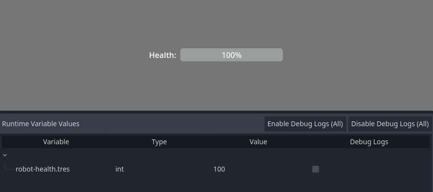

# Bindings

The core addon includes small UI scripts you can attach to common controls to keep them synced with MEDS variables.

Most binding scripts live under `addons/godot_meds_core/scripts/ui/`.

## At a glance

- Use these scripts when you want a control to reflect a variable automatically.
- Some bindings are one-way display bindings, while others are two-way editor bindings.
- `variable-driven-*` scripts are the current generic bindings.

## Which binding should I use?

| If you want to... | Use this script |
| --- | --- |
| Toggle a `BoolVariable` from a checkbox | `bool-driven-checkbox.gd` |
| Edit a `ColorVariable` from a color picker | `color-driven-color-picker.gd` |
| Show any variable as text in a label | `variable-driven-label.gd` |
| Edit a `FloatVariable` or `IntVariable` from a slider | `variable-driven-slider.gd` |
| Display a `FloatVariable` or `IntVariable` in a progress bar | `variable-driven-progress-bar.gd` |

## Basic usage

1. Add the target UI control, such as a `CheckBox`, `Label`, `Slider`, or `ProgressBar`.
2. Attach the matching script from `addons/godot_meds_core/scripts/ui/`.
3. In the Inspector, assign the exported variable resource.
4. For numeric controls, optionally configure clamping and range values on the variable resource itself.

## Current bindings

| Script | Best for | Exported property | Direction |
| --- | --- | --- | --- |
| `addons/godot_meds_core/scripts/ui/bool-driven-checkbox.gd` | `CheckBox` + `BoolVariable` | `bool_var: BoolVariable` | Two-way |
| `addons/godot_meds_core/scripts/ui/color-driven-color-picker.gd` | `ColorPickerButton` + `ColorVariable` | `color_variable: ColorVariable` | Two-way |
| `addons/godot_meds_core/scripts/ui/variable-driven-label.gd` | `Label` + any variable type | `variable: BaseVariable` | One-way |
| `addons/godot_meds_core/scripts/ui/variable-driven-slider.gd` | `Slider` + `FloatVariable` or `IntVariable` | `variable: NumericVariable` | Two-way |
| `addons/godot_meds_core/scripts/ui/variable-driven-progress-bar.gd` | `ProgressBar` + `FloatVariable` or `IntVariable` | `variable: NumericVariable` | One-way |

## Binding behavior

### Generic label binding

`variable-driven-label.gd` works with any variable type because it reads the value as a `Variant` and formats it with `str(...)`.

Inspector exports:

- `variable: BaseVariable`
- `prefix: String = ""`: text added before the variable value
- `suffix: String = ""`: text added after the variable value

`prefix` and `suffix` are simple formatting helpers for the label text. The binding converts the variable value with `str(...)`, then builds the final label as:

`prefix + str(value) + suffix`

This lets you add units, labels, or surrounding text without writing a custom script.

Common label formats:

- `prefix = "HP: "`, `suffix = ""` with value `75` becomes `HP: 75`
- `prefix = ""`, `suffix = "%"` with value `42` becomes `42%`
- `prefix = "Player: "`, `suffix = ""` with value `Robot` becomes `Player: Robot`
- `prefix = "("`, `suffix = ")"` with value `12` becomes `(12)`

Use `prefix` when the text should appear before the value, such as a field name.

Use `suffix` when the text should appear after the value, such as `%`, `HP`, `m`, or `pts`.

This is useful for text like health counters, names, scores, or debug labels.

### Numeric control bindings

`variable-driven-slider.gd` and `variable-driven-progress-bar.gd` both use `NumericVariable`.

Both scripts automatically:

- read the current numeric value on startup
- react to `value_changed(...)`
- react to `range_changed(...)`
- use the variable's `min_value` and `max_value` when `clamp_value` is enabled
- switch the slider or progress step to `1.0` when the bound variable is an `IntVariable`

Choose `variable-driven-slider.gd` when the player should be able to edit the variable through the UI.

Choose `variable-driven-progress-bar.gd` when the UI should only display the variable.

## Deprecated bindings

These older scripts still exist under `addons/godot_meds_core/scripts/ui/deprecated/`, but the current generic bindings are preferred.

| Deprecated script | Preferred replacement |
| --- | --- |
| `addons/godot_meds_core/scripts/ui/deprecated/float-driven-label.gd` | `addons/godot_meds_core/scripts/ui/variable-driven-label.gd` |
| `addons/godot_meds_core/scripts/ui/deprecated/string-driven-label.gd` | `addons/godot_meds_core/scripts/ui/variable-driven-label.gd` |
| `addons/godot_meds_core/scripts/ui/deprecated/float-driven-slider.gd` | `addons/godot_meds_core/scripts/ui/variable-driven-slider.gd` |

## Example setups

### Label bound to any variable

Create a variable resource such as `health.tres` using `FloatVariable`.

Attach `variable-driven-label.gd` to the label and set:

- `variable = health.tres`
- `prefix = "HP: "`

Result: if the variable value is `75`, the label shows `HP: 75`.

### Slider bound to a numeric variable

Create a variable resource such as `music-volume.tres` using `FloatVariable`.

Attach `variable-driven-slider.gd` to the slider and set:

- `variable = music-volume.tres`

If `music-volume.tres` has `clamp_value` enabled, the slider range follows that variable's `min_value` and `max_value` automatically.

### Progress bar bound to a numeric variable

Create a variable resource such as `robot-health.tres` using `IntVariable` or `FloatVariable`.

Attach `variable-driven-progress-bar.gd` to the progress bar and set:

- `variable = robot-health.tres`

If `health.tres` has `clamp_value` enabled, the progress bar uses the same `min_value` and `max_value` as the variable.

## Notes

- `bool-driven-checkbox.gd` and `color-driven-color-picker.gd` expect their exported variable to be assigned before `_ready()` runs.
- `variable-driven-label.gd`, `variable-driven-slider.gd`, and `variable-driven-progress-bar.gd` guard against a missing variable more gracefully, but they are still most useful when the resource is assigned.
- Two-way bindings call `set_value(..., self)` so the variable can track the caller.
