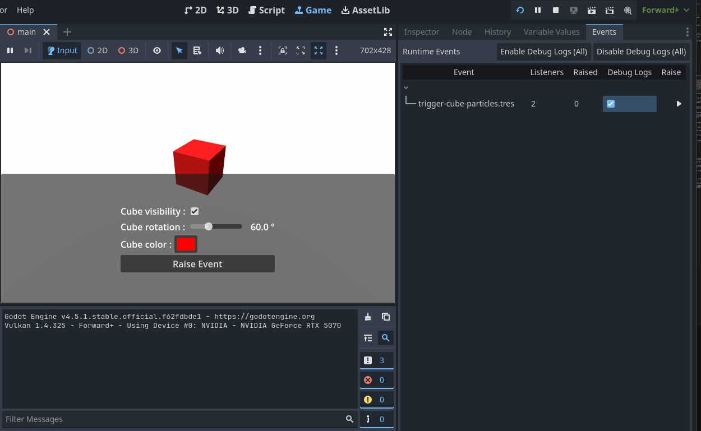

# Events Runtime Debugger

A dock named **Events** shows events that are discovered/registered at runtime.

- Shows listener count and how many times each event was raised.
- Can raise an event from the editor while the game is running.
- Toggle `debug_logs` per event (or bulk enable/disable).

Under the hood:

- Runtime reports/updates via `EventRuntimeReporter`.
- Editor listens via `EventsDebugger` and updates the dock UI.
