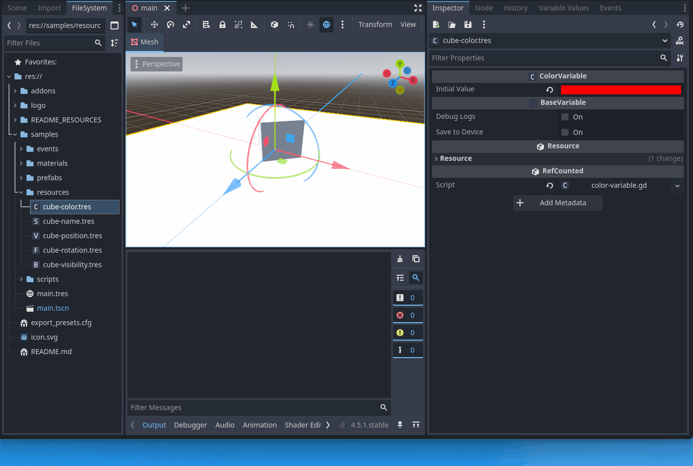

# Offline Reference Tracking

In the FileSystem dock, right-click a variable `.tres` and choose **Log references** to print any `.tscn` / `.tres` files that reference it.

This is a best-effort text scan of project files (useful for refactors and cleanup).

## Clickable output links

When `debug_logs` are enabled, debug output may include clickable links that open the correct scene and select the node that caused the change/raise.

