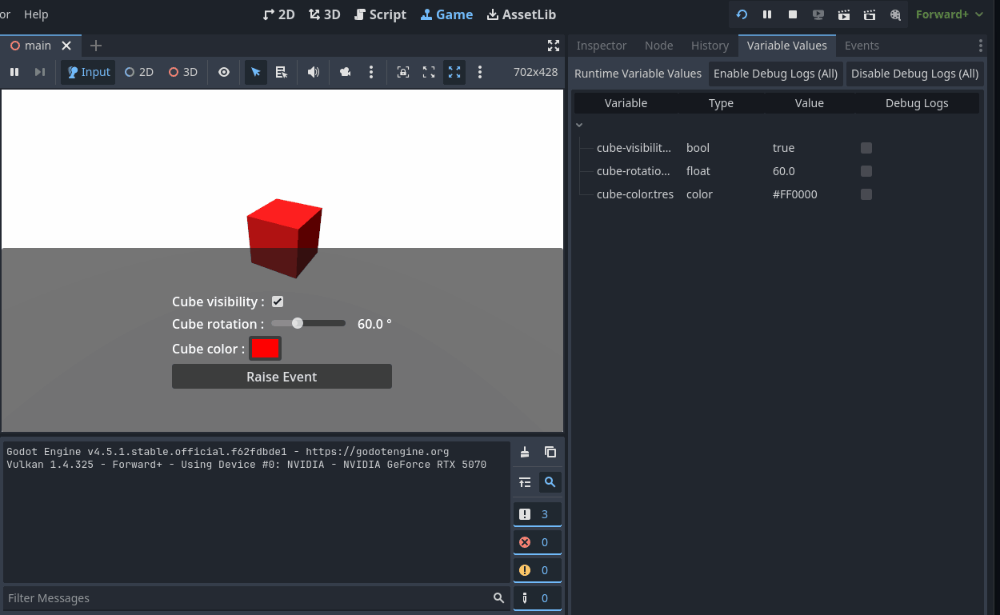

# Variables Runtime Debugger

A dock named **Variable Values** shows any variables that report values during runtime.

- Live-updates as values change.
- Edit a value in-place to push the change back into the running game.
- Toggle `debug_logs` per variable (or bulk enable/disable).

Under the hood:

- Runtime sends debugger messages via `VariableRuntimeReporter`.
- Editor listens via `VariableValuesDebugger` and updates the dock UI.
