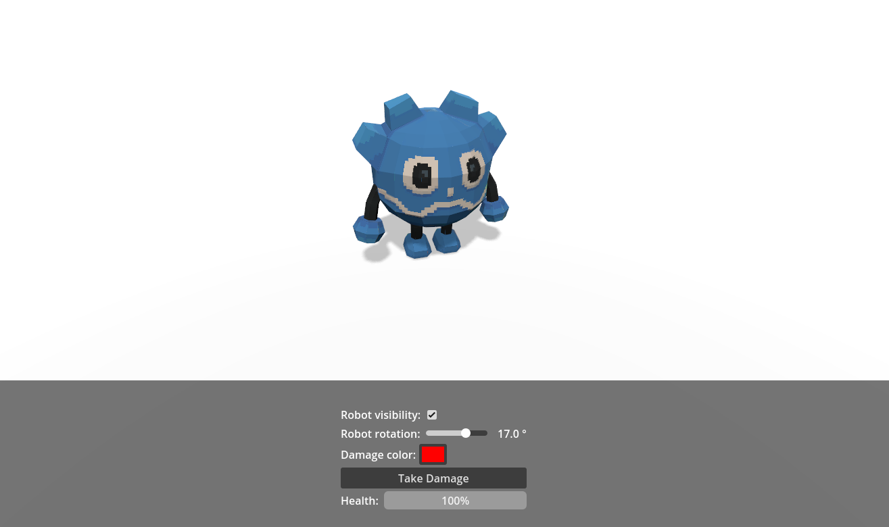

# Overview

The MEDS sample is a small Godot project that demonstrates how variables, events, bindings, and editor tools work together in a real scene.

If you want to see MEDS in action quickly, this is the best place to start.

## What the sample shows

- resource-driven game state through `.tres` variables such as `robot-health.tres`, `robot-rotation.tres`, and `robot-name.tres`
- event-driven gameplay through `samples/events/take-damage.tres`
- UI bindings through `variable-driven-label.gd`, `variable-driven-slider.gd`, `variable-driven-progress-bar.gd`, `bool-driven-checkbox.gd`, and `color-driven-color-picker.gd`
- scene logic reacting to shared variables instead of relying on tightly coupled nodes
- debugger-friendly resources that can also be inspected with the MEDS editor tools

## Main scenes

| Scene | Purpose |
| --- | --- |
| `samples/main.tscn` | Main sample scene with the robot, menu, audio manager, and scene manager |
| `samples/prefabs/menu.tscn` | UI panel that edits and displays MEDS resources through bindings |
| `samples/prefabs/player.tscn` | Robot prefab and related listeners that react to variables and events |
| `samples/game-over.tscn` | Game over screen shown when the health variable reaches zero |

## Main resources

| Resource | Role in the sample |
| --- | --- |
| `samples/resources/robot-health.tres` | Shared health state used by the robot, progress bar, heartbeat controller, and scene manager |
| `samples/resources/damage-amount.tres` | Amount removed from health each time damage is triggered |
| `samples/resources/robot-rotation.tres` | Rotation value controlled by the slider and applied to the robot |
| `samples/resources/robot-visibility.tres` | Boolean used to toggle whether the robot is visible |
| `samples/resources/robot-name.tres` | Text displayed in labels through `variable-driven-label.gd` |
| `samples/resources/damage-color.tres` | Color value used to tint the robot material |
| `samples/events/take-damage.tres` | Event raised by the UI button to trigger damage reactions |

## What to try in the sample

1. Toggle the checkbox to show or hide the robot.
2. Move the slider to rotate the robot.
3. Change the color picker to update the robot material.
4. Click `Take Damage` to raise the damage event.
5. Watch the progress bar, audio feedback, and scene transition react to the same shared resources.

## Folder tour

| Folder | Contents |
| --- | --- |
| `samples/resources/` | Variable resources used by the sample |
| `samples/events/` | Event resources used by the sample |
| `samples/prefabs/` | Reusable scene pieces such as the menu and player |
| `samples/scripts/` | Small glue scripts that bind nodes to variables and events |
| `addons/godot_meds_core/scripts/ui/` | Reusable MEDS UI binding scripts used by the menu |

## Suggested reading order

1. Open `samples/main.tscn` to see the full sample scene.
2. Inspect `samples/prefabs/menu.tscn` to see how bindings connect UI controls to resources.
3. Inspect `samples/prefabs/player.tscn` and `samples/scripts/robot.gd` to see how gameplay reacts to MEDS events and variables.
4. Read the next page in this section for the full gameplay flow.